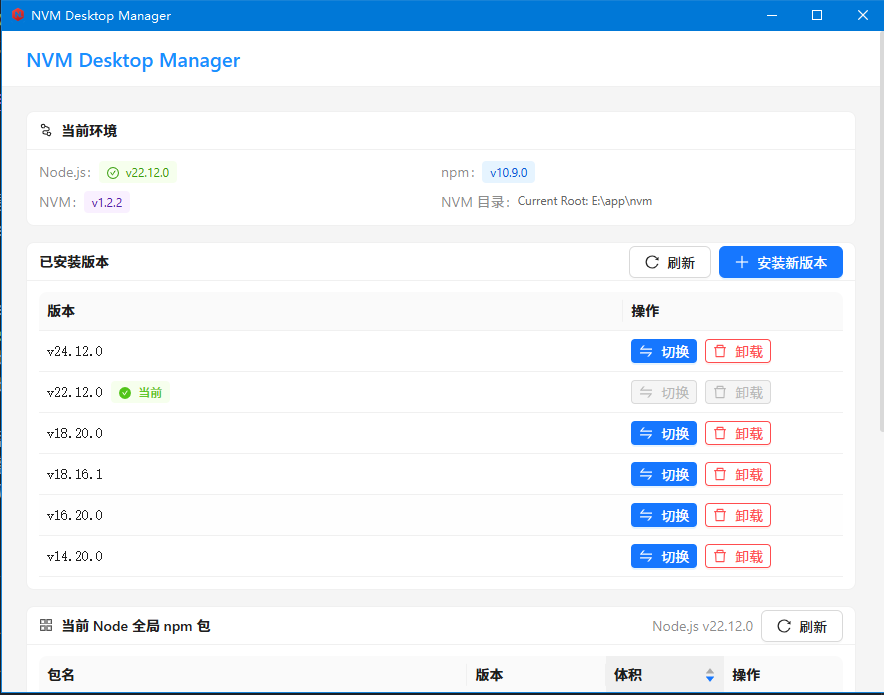

# NVM Desktop Manager

一个基于 Wails + React + Ant Design 的 Node.js 版本管理桌面应用，提供可视化界面管理本机 Node.js 版本。



## 功能特性

- 查看已安装的 Node.js 版本列表
- 一键切换 Node.js 版本
- 安装新的 Node.js 版本（支持版本列表选择）
- 卸载已安装的版本
- 显示当前 Node.js、npm、nvm 版本信息
- 操作日志记录

## 技术栈

- **后端**: Go + Wails v2
- **前端**: React 18 + TypeScript + Vite
- **UI**: Ant Design 5.x
- **状态管理**: Zustand

## 前置要求

- [nvm-windows](https://github.com/coreybutler/nvm-windows) 已安装并配置到系统 PATH
- Go 1.21+
- Node.js 16+
- [Wails CLI](https://wails.io/docs/gettingstarted/installation)

## 开发

```bash
# 克隆项目
git clone https://github.com/your-username/nvmdesk.git
cd nvmdesk

# 安装前端依赖
cd frontend && npm install && cd ..

# 启动开发模式
wails dev
```

## 构建

```bash
# 构建生产版本
wails build
```

构建产物位于 `build/bin/` 目录。

## 项目结构

```
nvmdesk/
├── app.go              # Wails App 主结构体
├── main.go             # 程序入口
├── nvm_service.go      # NVM 命令封装服务
├── types.go            # Go 类型定义
├── wails.json          # Wails 配置
├── frontend/           # 前端代码
│   ├── src/
│   │   ├── components/ # React 组件
│   │   ├── stores/     # Zustand 状态管理
│   │   └── App.tsx
│   └── package.json
└── docs/               # 文档
```

## License

MIT
